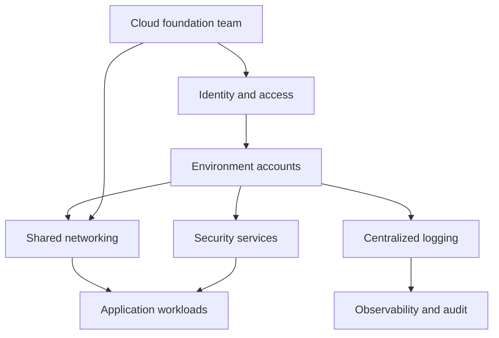

# AWS landing zone starter

```mermaid
flowchart TD
    Identity[Identity and access] --> Accounts[Environment accounts]
    Accounts --> Networking[Shared networking]
    Accounts --> Logging[Centralized logging]
    Accounts --> Security[Security services]
    Networking --> Workloads[Application workloads]
    Security --> Workloads
    Logging --> Observability[Observability and audit]
    PlatformTeam[Cloud foundation team] --> Identity
    PlatformTeam --> Networking
```

The first landing zone starter focuses on the minimum shared services that most client environments need before application onboarding begins.
