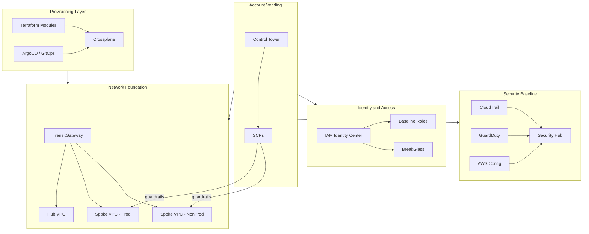

# Cloud Foundations Architecture

TCS Cloud Foundations delivers a layered, opinionated AWS account baseline designed for repeatable deployment across TCS client engagements. Each layer has a clear responsibility boundary - account governance sits at the top, workload provisioning at the bottom - so teams can adopt individual layers without requiring the full stack.

## Account Vending

AWS Control Tower manages account provisioning and baseline guardrails. Service Control Policies (SCPs) are applied at the OU level to enforce non-negotiable security boundaries - for example, preventing disabling of CloudTrail or creating unencrypted S3 buckets. Account Factory for Terraform (AFT) customizations layer TCS-specific controls on top of the Control Tower baseline.

## Network Foundation

A hub-and-spoke transit gateway topology connects production and non-production VPCs to shared services. The hub VPC hosts inspection, DNS resolution, and egress traffic. Spoke VPCs are provisioned via the TCS VPC Terraform module (`modules/vpc/`), which enforces consistent tagging, AZ spread, and flow log configuration. Private connectivity to AWS services uses VPC endpoints attached to the private route tables exposed in the module output.

## Identity and Access

IAM Identity Center (formerly SSO) is the entry point for all human access. Permission sets map to the IAM baseline roles defined in `modules/iam-baseline/` - ReadOnly, Developer, PlatformEngineer, and BreakGlass. All human roles require MFA. The CICD role trusts GitHub Actions via OIDC, eliminating long-lived access keys from CI pipelines.

## Security Baseline

CloudTrail, GuardDuty, and AWS Config are enabled in all regions. Security Hub aggregates findings into a single pane of glass with CIS AWS Foundations Benchmark controls enabled. Config rules enforce the guardrail checklist defined in the platform standards. Findings are routed to the TCS Security Operations team via SNS-to-SIEM integration.

## Provisioning Layer

Account-level infrastructure (VPC, IAM, DNS, security baseline) is managed by Terraform with state in Terraform Cloud. Workload-level resources - databases, queues, object storage - are provisioned via Crossplane compositions, giving application teams a Kubernetes-native API with automatic drift reconciliation. ArgoCD drives both the Crossplane installation and the composition deployment from Git.

## Key Decisions

| Decision | Rationale | Status |
|----------|-----------|--------|
| Terraform for account-level foundations | Better dependency graph handling for complex account-level resources (VPC, IAM, DNS). Terraform state provides a reliable source of truth for resources that change infrequently. | Confirmed |
| Crossplane for workload resources | Kubernetes-native API enables app teams to self-service without platform team involvement. Reconciliation loop handles drift automatically, reducing operational toil. | Confirmed |
| Hub-spoke networking via Transit Gateway | Centralizes egress, inspection, and shared services. Spoke VPCs remain isolated from each other. Scales cleanly as the number of accounts grows. | Confirmed |
| crossplane-contrib/provider-aws (v0.43+) | Mature, well-documented provider. Upbound official family model is a long-term win but migration path from contrib is currently underdocumented. Revisit at 6 months. | Confirmed - see ADR in docs/decisions/ |
